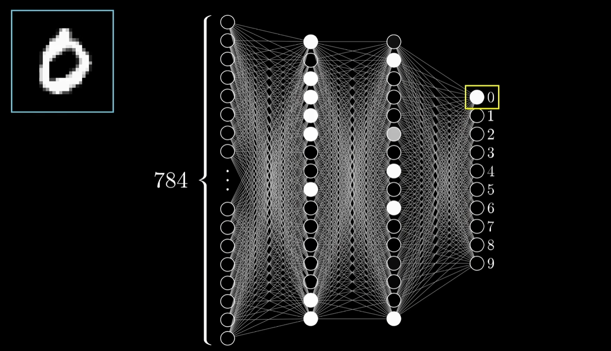
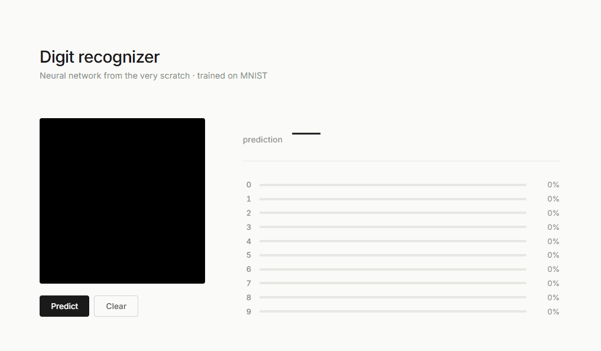
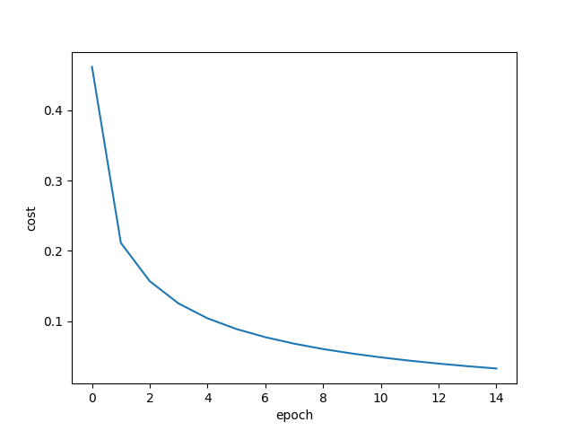

# neural network from scratch

I built this in my first year of Computer Engineering. It recognizes handwritten digits with around 97% accuracy on MNIST (and a little lower on the web), written entirely with NumPy, plus a small web app where you draw a digit with your mouse and watch it predict. Try it [here](https://huggingface.co/spaces/linkyAI/mnist-recognizer).

I had been doing competitive programming for a few years and at some point in 2025 it stopped being possible to ignore that the models were starting to do what I had spent years training myself to do (not exactly, but you know what I mean, do you?). Then I figured I had two options. Either I get better than them, which is mostly a joke, or I learn what's underneath them. The decision was clear.

The push, though, was the 3Blue1Brown video on neural networks. Beautiful video. You watch it once and you feel like you understand something. However, surprise! You don't. At least you don't really. The moment you sit down to write one you find the parts the video had to skip because (of course) they don't render well. And exactly those are the parts that really matter. For instance: the chain rule across matrices. What it actually means to take the derivative of a function whose input is a matrix and whose output is a single number? You have to chew on that yourself, duh!

The rule I gave myself was simple. If NumPy has it, I can use it. Think about it. Multiplying matrices or computing an exponential, that's already optimized in BLAS and rewriting it would be performative (?). If it's part of the network itself, I write it.

## what's in the project

The network has 784 input neurons (a flattened 28x28 image), one hidden layer of 256 neurons with sigmoid, and an output layer of 10 neurons with softmax. Around 200,000 parameters that start out random and end up recognizing digits. Tiny by modern standards. A model like GPT-4, for example, has roughly five million times more, but the principles are the same.

Training is mini-batch gradient descent on MNIST with cross-entropy loss, He initialization for the weights, and data augmentation that randomly rotates and shifts each image during training so the network doesn't end up overfit to perfectly-centered digits. There's a Flask server that loads the trained weights once at startup and a small frontend with an HTML canvas, so you can draw and watch the prediction update in real time, with a bar for each of the ten digits.

## the math

The forward pass for one layer is the same line written twice. First the pre-activation, then the activation:

$$Z = W \cdot a + b$$

$$S = \sigma(Z)$$

For the hidden layer $\sigma$ is sigmoid, $\sigma(x) = \frac{1}{1 + e^{-x}}$, with derivative $\sigma'(x) = \sigma(x)(1 - \sigma(x))$. The output layer uses softmax, which turns the raw vector of ten numbers into a proper probability distribution that sums to one, which is more intuitive than just the sigmoid:

$$\text{softmax}(x_i) = \frac{e^{x_i}}{\sum_j e^{x_j}}$$

The cost is cross-entropy. For a single example with a one-hot label it collapses to the log of the predicted probability of the correct class, which is as honest as a loss function gets:

$$C = -\log(\hat{y}_{\text{correct}})$$

Backpropagation is the chain rule applied backwards through the network. The clean part is that softmax and cross-entropy, when you derive their composition, collapse into a single subtraction:

$$\frac{\partial C}{\partial Z_2} = S - y$$

The whole horrible derivative of softmax, with its two cases and the Jacobian I had been afraid of, was just gone, idk, it was kind of nice?

From there the gradients for the second layer are the outer product of that signal with the previous activations, divided by the batch size, and the bias gradient is the average across the batch:

$$dW_2 = \frac{1}{N} \, dZ_2^\top S_1, \qquad db_2 = \frac{1}{N} \sum dZ_2$$

To propagate the error back to the hidden layer you multiply by the transpose of the weights and pointwise by the derivative of sigmoid:

$$dZ_1 = (dZ_2 \cdot W_2) \odot \sigma'(Z_1)$$

And the gradients for the first layer follow the same shape as before:

$$dW_1 = \frac{1}{N} \, dZ_1^\top X, \qquad db_1 = \frac{1}{N} \sum dZ_1$$

Everything updates with plain gradient descent, $w \leftarrow w - \eta \cdot dw$. Nothing fancier. Adam, RMSprop, momentum, are improvements you'd reach for in a more serious project, but for MNIST this is more than enough.

## structure

    neural-network/
    ├── network.py        # Layer, NeuralNetwork, math functions
    ├── train.py          # training loop with augmentation and mini-batches
    ├── evaluate.py       # loads weights, measures accuracy on test set
    ├── server.py         # Flask server for the web visualizer
    ├── templates/
    │   └── index.html
    ├── static/
    │   ├── script.js
    │   └── style.css
    └── requirements.txt

There's also a separate repo with the full writeup of the project, in Spanish, structured as an Obsidian vault and deployed with Quartz. If anything here felt rushed, the depth is [over there](https://linkyless.github.io/neural-network-notes).

## running it

    pip install -r requirements.txt
    python train.py        # ~3 minutes on CPU, saves weights as .npy
    python evaluate.py     # prints test accuracy
    python server.py       # web visualizer at localhost:5000

If the weights are already on disk you can skip training and go straight to the server.

## results

Around 97% accuracy on MNIST test set, three minutes of training on CPU, real-time inference in the browser through Flask. There's also a [deployed version](https://huggingface.co/spaces/linkyAI/mnist-recognizer) of the visualizer if you want to try it without cloning anything.
